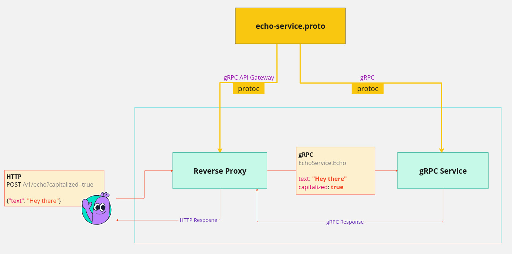

# Introduction

gRPC API Gateway is a plugin for the protocol buffers [protoc](https://github.com/protocolbuffers/protobuf)
that reads protocol buffer and gRPC service definitions to generate a reverse-proxy HTTP server handler in Go.
This handler is compatible with the standard library's http package and enables translation of HTTP API calls into gRPC.

{ align=left }

## Overview

gRPC Gateway is a versatile tool that bridges the gap between gRPC services and HTTP-based APIs, including RESTful or WebSockets. It enables clients that do not support gRPC natively to communicate with gRPC servers using familiar HTTP and JSON formats. This capability is particularly valuable for integrating gRPC services into existing systems or for clients operating in environments where gRPC is not directly supported.

The gateway seamlessly translates incoming HTTP/JSON requests into corresponding gRPC calls, facilitating the integration of gRPC services into a wide range of applications. It offers additional functionalities such as request/response transformation, JSON request validation, and customizable error handling, enhancing the flexibility and robustness of the integration process.

Additionally, there is a versatile plugin that can generate a corresponding OpenAPI v3.1 document for the resulting HTTP API. However, since OpenAPI is generally meant to capture RESTful APIs, it does not automatically generate documentation for WebSocket bindings.

In essence, gRPC Gateway streamlines the exposure of gRPC services to clients that require HTTP-based interfaces, simplifying the development and deployment of services that cater to diverse client environments. This capability is especially beneficial for clients operating in web browsers, where direct gRPC support may be limited.

## Rationale

:heart: Inspiration and Gratitude:
This project is deeply inspired by the widely recognized [gRPC Gateway](https://grpc-ecosystem.github.io/grpc-gateway).
Building upon its established and stable implementation has enabled rapid development of similar features,
allowing us to focus on introducing new functionality.
We extend our sincere thanks to the creators of the gRPC Gateway for laying the foundation.

This project aims to implement features that the gRPC Gateway project does not plan to cover. These include bidirectional streaming APIs, dynamic reverse proxy capabilities, and full support for OpenAPI v3.1 specification. These additions enhance the versatility and power of the gRPC API Gateway, providing users with a comprehensive solution for their API gateway needs.

## Key Differences

The differences can be summerized into the following points

#### __Streaming APIs__
This plugin offers broader support for streaming APIs, including [WebSockets](https://en.wikipedia.org/wiki/WebSocket),
[Server-Sent Events (SSE)](https://en.wikipedia.org/wiki/Server-sent_events),
and [Chunked Transfer](https://en.wikipedia.org/wiki/Chunked_transfer_encoding) for
all directions, including long-lived bidirectional methods.

#### OpenAPI v3.1 Support

A primary goal of this project was to support the OpenAPI v3.1 specification.
This includes finer control over field nullability and necessity (required or not).
This precision in OpenAPI specification allows for more accurate generation of client code, such as JavaScript/TypeScript.

#### Improved Configuration Format

Significant effort has been invested in simplifying and enhancing the configuration format.
Configurations can now be spread across multiple files, allowing for different
configuration flavors (e.g., in proto files vs. standalone files)
and reducing repetition through inheritance in configurations.
Additionally, there is finer control over the presence and naming of query parameters and path parameters.

#### Gateway Errors

Most errors encountered by the gateway, such as missing parameters, incorrect types, and unsupported streaming methods,
are exported error types so the error handler has the opportunity to handle each scenario differently.

#### Dynamic Reverse Proxy (In Progress)

While generating Go code for the reverse proxy already facilitates providing an HTTP interface to a gRPC API,
applications written in languages other than Go require an additional step of installing Go and compiling the generated code.

This project aims to provide a solution by allowing users to embed or install a binary version of the gRPC API Gateway,
preserving the same configuration file format. This will enable quick setup of a reverse proxy for a gRPC API and
generation of OpenAPI documentation.

Initial language support will include _Python_, _Rust_, _Node.js_, _C_, and _C++_ with embedded support.
